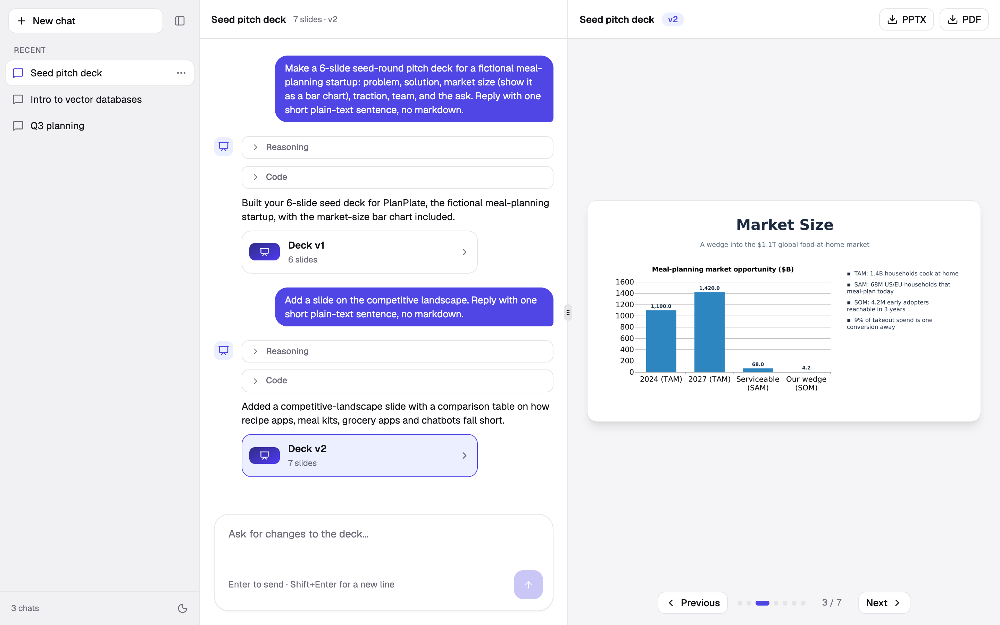

# Presentation Generator Agent

Describe a presentation in chat and get a real, downloadable slide deck. An AI model writes a
`python-pptx` program, it runs in an isolated container, and the resulting slides show up in a live
preview. Ask for changes in plain English and each one becomes a new version.



## How to use it

1. Click **New chat** and describe a deck, for example *"A 6-slide seed-round pitch deck for a meal-planning startup."*
2. Watch the model's **Reasoning** and **Code** stream in, then the slides appear on the right.
3. Ask for changes: *"add a slide on the competitive landscape"*. Each change creates a new **Deck vN** box in the chat;
   click one to view that version.
4. Flip through slides with **Previous / Next** (or the arrow keys) and download the deck with **PPTX** or **PDF**.
5. Use a chat's **⋯** menu to rename or delete it. The sidebar collapses, and there's a light/dark toggle.

If the model's code fails, the error is fed back to it and it fixes the program automatically.

## Running it locally

**Prerequisites:** Docker with Compose, and a [DeepSeek API key](https://platform.deepseek.com).

### 1. Set up the env file

```bash
cp .env.example .env
```

Open `.env` and set your key:

```bash
DEEPSEEK_API_KEY=sk-...
```

Everything else has a working default. Optional settings: `DEEPSEEK_MODEL`, `REASONING_EFFORT`
(`low` / `medium` / `high` / `max` / `off`), `STORAGE_DIR`, and `RUNNER_TOKEN` (shared secret between
the API and the runner).

### 2. Start everything

```bash
docker compose up --build
```

Open **http://localhost:5173**. This starts the frontend, the API (port 3001), the runner, and Postgres.
`docker compose down` stops it, and `docker compose down -v` also wipes the database.

### Running the frontend and API on your machine instead (for development)

You also need Node.js 22+, pnpm 10+ (`corepack enable`), and `brew install libreoffice poppler`.

```bash
docker compose -f docker-compose.yml -f docker-compose.dev-runner.yml up -d db runner
cd api && pnpm install && pnpm run prisma:migrate && pnpm run dev     # http://localhost:3001
cd frontend && pnpm install && pnpm run dev                           # http://localhost:5173
```

The API reads `.env` from the repo root. Use the `pnpm run prisma:*` scripts rather than calling `prisma`
directly, since they load that file.

## Tech stack

- **Frontend:** React 19, Vite 6, TypeScript, Tailwind 4, shadcn/ui
- **API:** Fastify 5, Prisma 6, PostgreSQL 17, Zod, streaming to the browser with Server-Sent Events
- **AI:** DeepSeek through its OpenAI-compatible Responses API (reasoning, streaming, tool calling)
- **Runner:** FastAPI and python-pptx in its own container
- **Slide rendering:** LibreOffice and poppler (`.pptx` to PDF to PNG), inside the API container
- **Tooling:** pnpm, Docker Compose

## Codebase layout

```
frontend/   React app: chat sidebar, conversation, slide previewer
api/        Fastify API
  src/pipeline.ts   agent loop and build orchestration
  src/llm.ts        DeepSeek streaming and the createSlides tool
  src/runner.ts     HTTP client for the runner
  src/render.ts     pptx to pdf to png
  src/files.ts      slide image and PPTX/PDF download routes
runner/     isolated service that runs the model's python-pptx code
docs/       build-flow.md (diagram), presentation-workflow-explanation.md (full walkthrough), review.md
docker-compose.yml
```

`frontend/src/types.ts` and `api/src/types.ts` are a hand-maintained shared contract, so keep them in sync.
For how a deck gets built end to end, see
[docs/presentation-workflow-explanation.md](docs/presentation-workflow-explanation.md).

**Using Daytona instead of the runner.** The runner is the default way to execute the model's code, but
[Daytona](https://www.daytona.io) (a managed sandbox service) can be used instead. The API only needs
something that takes the program and returns the `.pptx` bytes, which today is `postBuild` in
`api/src/runner.ts`. The project originally ran on Daytona and that code is still in git history
(`git show f4a4ed1:api/src/daytona.ts`). It isn't a config switch: restore that file and `@daytona/sdk`,
call `runBuildInSandbox` from `runBuild` in `api/src/pipeline.ts`, add back the `Chat.sandboxId` column with a
migration, and set `DAYTONA_API_KEY`.
