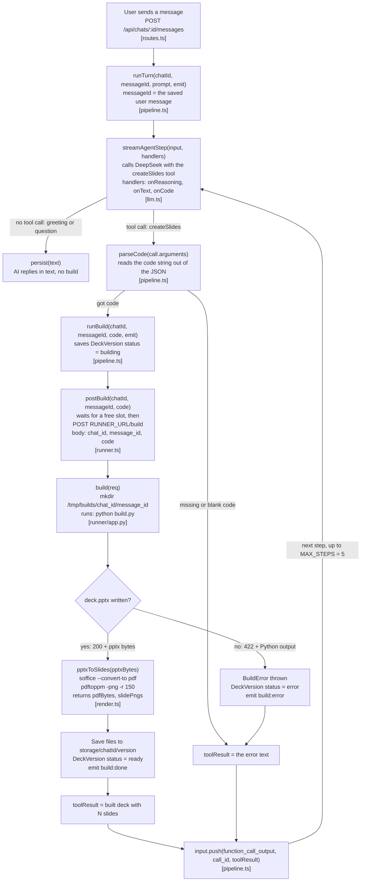

# How the AI writes code and it gets run

Each box shows the function that runs and its main arguments. The file is in brackets.

- **On success** the next `streamAgentStep` lets the AI write its short summary, and the loop ends when it answers without a tool call.
- **On an error** the same loop runs again, and the AI reads the error and calls `createSlides` with fixed code.
- **The runner** deletes `/tmp/builds/<chatId>/<messageId>` when the build ends, and it has no secrets and no network access.
- **Two similar names:** `runBuild` in `pipeline.ts` does the whole build (runner, render, save). `postBuild` in `runner.ts` is only the HTTP POST to the runner.
